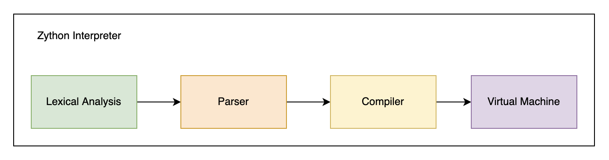

# Overview

This document contains a high-level overview of the Zython compiler pipeline.

The Zython execution model is split into four major stages.

The first stage is lexical analysis, which tokenizes the raw program string input into a list of token objects. Next, the parser constructs an Abstract Syntax Tree (AST) from the tokens, representing a hierarchical, tree-like structure of the program. The compiler then transforms the AST into bytecode instructions. Lastly, the VM interprets the bytecode instructions and actually executes the program.

This is a very high-level overview of what the interpreter actually does.

## Project Organisation

The lexer and parser can be found in `/frontend`. The compiler can be found in `/compiler`, and the VM can be found in `/vm`. The `/runtime` folder holds the runtime for the interpreter. This is just a program that calls all of the other stages and essentially acts as a pipeline orchestrator for the interpreter. There is also an additional stage which analyzes the semantics of the AST in `/compiler/analyze`.

Some example executable Python scripts can be found in `/example`.